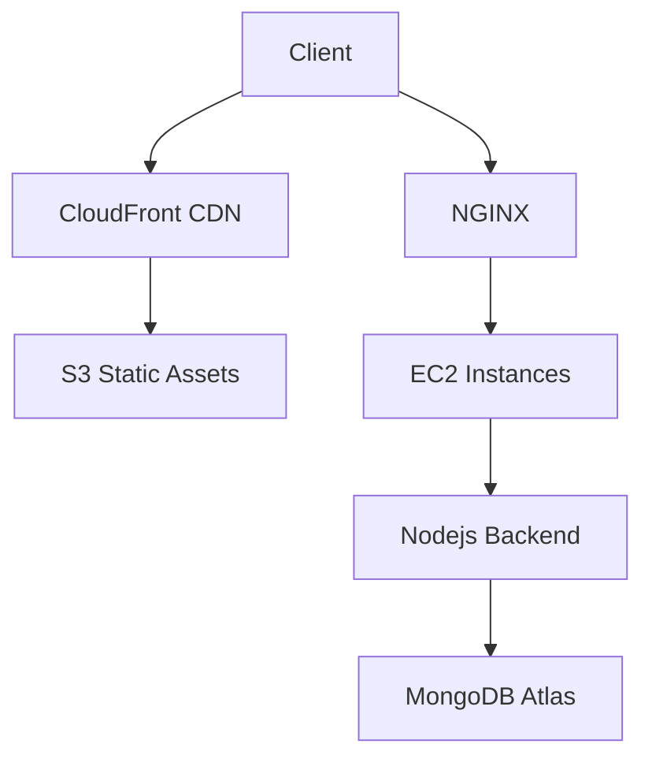

# NetThreads 🌐🧵

**A Modern Social Media Platform for Thoughtful Conversations**  
*Where Threads Unravel Meaningful Interactions*

**Deployed URL -> https://netthreads.crabdance.com**


---

## 🚀 Overview
NetThreads is a high-performance social media application designed for users to share content publicly with an emphasis on structured, nested conversations. Built with cutting-edge technologies and deployed on AWS infrastructure, this project demonstrates scalable full-stack development practices with enterprise-grade optimizations.

  
*Homepage featuring trending threads and engagement metrics*

---

## 🛠️ Tech Stack Symphony

### Frontend


### Backend


### Infrastructure


---

## 🔑 Key Features

### 🔐 JWT Authentication System
- Dual token strategy with access/refresh tokens.
- Secure HTTP-only cookies for token storage.
- Automatic token rotation mechanism.

### 🧬 Nested Conversation Threads
- Infinite comment nesting with collapsible UI.
- Context-preserving thread navigation.
- Real-time depth indicators.


### 🔍 Atlas-Powered Fuzzy Search
- MongoDB Atlas Search integration.
- Autocomplete suggestions.
- Typo-tolerant query parsing.


### 📧 OTP Email Verification
- NodeMailer integration with SMTP pooling.
- Cron-based OTP expiration (Node Schedule).
- Secure OTP hashing with bcrypt.


---

## 🏗️ Deployment Architecture



---

## 📦 AWS Free Tier Services Utilization


## ⚡ Performance Optimizations
- Connection pooling for concurrent connections.
  

## 🗂️ Database Excellence
- Indexing on frequently queried fields.
- Atlas Search indexes for text queries.
 

## 🕒 Cron Job Automation
- Daily expired OTP cleanup.
- 
  

## 🚦 Production Monitoring
- PM2 process management with clustering.
- NGINX reverse proxy configuration.
- Connection rate limiting.
- 


## 🖼️ Media Management
- User Upload → S3 Bucket → CloudFront Distribution → CDN Caching.
- Signed URL generation for secure uploads.

---

## 🛠️ Installation Guide

### Backend Setup
```sh
git clone https://github.com/jatinkharbanda33/NetThreads.git
cd backend
npm install
```


### Frontend Setup
```sh
cd client
npm install
npm run build
```

---

## 📈 Future Roadmap
- Real-time chat implementation.
- User analytics dashboard.
- Cross-platform mobile app.
- AI-powered content recommendations.
- WebSocket-based notifications.

---

## 🤝 Contributors
**Jatin Kharbanda** - Full Stack Architect

---

## 📜 License
MIT
